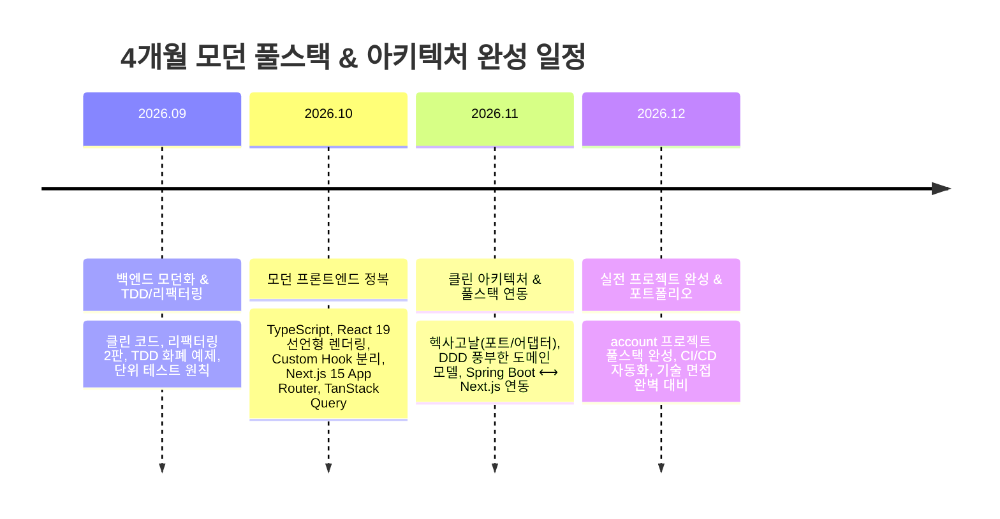

# 🧠 GEMINI.md - Software Craftsmanship & Architecture Study Context

이 파일은 **하성호 엔지니어**와 **AI 페어 프로그래밍 어시스턴트(Antigravity)** 간의 스터디 맥락, 개발자 프로필, 4개월 마스터 로드맵, 그리고 프로젝트 아키텍처 연계 규칙을 영구히 보존하기 위한 마스터 컨텍스트 문서입니다.

---

## 👤 1. 개발자 프로필 & 학습 목표

* **엔지니어**: 하성호 (`skyg547@gmail.com` / GitHub: [`skyg547`](https://github.com/skyg547))
* **경력 및 강점**:
  - 6년 차 백엔드 소프트웨어 엔지니어 (케이뱅크 자금운용/회계시스템, 아성다이소 회계시스템)
  - 대규모 자산 거래, 회계 원장(G/L), 결산 프로세스, `BigDecimal` 1원 단위 데이터 정합성, DB 트랜잭션 및 배치 처리에 강한 실무 내공 보유
* **학습 및 전환 목표 (2026 하반기 완성)**:
  - **백엔드**: 레거시 탈출 ➔ 클린 코드, 리팩터링 2판(악취 24가지), 단위 테스트의 정석(TDD), 진짜 객체지향(오브젝트)
  - **아키텍처**: 헥사고날 아키텍처(Ports & Adapters), DDD(Aggregate Root, Rich Domain Model), 이벤트 주도 설계
  - **프론트엔드**: 바닐라 JS/JSP/Thymeleaf ➔ **TypeScript + React 19 + Next.js 15 (App Router / RSC)**로 프론트 스택 고정
* **핵심 포트폴리오 프로젝트**:
  - [`skyg547/account`](https://github.com/skyg547/account): 세무/회계 멀티모듈 헥사고날 아키텍처 백엔드 + Next.js 대시보드 풀스택 연동

---

## 🗺️ 2. 4개월 압축 마스터 로드맵 (2026.09 ~ 2026.12)

---

## 📚 3. 엄선 도서 12권 마스터 카탈로그

| 단계 | 도서명 | 저자 / 출판사 | 핵심 학습 목표 |
| :--- | :--- | :--- | :--- |
| **1단계** | 『클린 코드』 | 로버트 C. 마틴 / 인사이트 | 의미 있는 이름, 작고 단일한 함수, 오류 처리 |
| **1단계** | 『리팩터링 2판』 | 마틴 파울러 / 한빛미디어 | 24가지 코드 악취 식별, 단계별 리팩터링 기법 |
| **1단계** | 『테스트 주도 개발(TDD)』 | 켄트 벡 / 인사이트 | Red-Green-Refactor 사이클, 테스트 안전그물 |
| **1단계** | 『단위 테스트』 | 블라디미르 코리코프 / 위키북스 | 좋은 테스트 vs 나쁜 테스트 구별, 도메인 단위 테스트 |
| **2단계** | 『오브젝트』 | 조영호 / 위키북스 | 역할/책임/협력 기반 진짜 객체지향 설계 |
| **2단계** | 『헤드 퍼스트 디자인 패턴』 | 에릭 프리먼 / 한빛미디어 | GoF 디자인 패턴(전략, 팩토리, 데코레이터 등) |
| **2단계** | 『이펙티브 자바 3판』 | 조슈아 블로크 / 인사이트 | 모던 자바 관용구, 불변 객체, Enum, 람다/스트림 |
| **3단계** | 『만들면서 배우는 클린 아키텍처』 | 톰 홈버그 / 위키북스 | 스프링 부트 헥사고날(Ports & Adapters) 실전 |
| **3단계** | 『클린 아키텍처』 | 로버트 C. 마틴 / 인사이트 | SOLID 원칙, 컴포넌트 결합/응집 원칙 |
| **3단계** | 『도메인 주도 설계 핵심』 | 반 버논 / 에이콘 | Bounded Context, Aggregate Root, 도메인 이벤트 |
| **4단계** | 『우아한 타입스크립트 with 리액트』 | 우아한형제들 / 위키북스 | 백엔드 관점에서의 TypeScript & React 아키텍처 |
| **4단계** | 『실전 Next.js 14/15 프로그래밍』 | - | App Router, Server Components, Route Handlers |

---

## ⚙️ 4. 스터디 진행 규칙 & 하네스(Harness) 가이드

1. **[숲 ➔ 나무] 대화형 스터디 원칙**:
   - 먼저 책의 핵심 철학/비유(숲)를 10분 대화로 이해 ➔ `account` 또는 실습 코드(나무)로 즉시 매핑.
2. **원클릭 실행 하네스(Harness)**:
   - 모든 스터디 코드는 Java 17 표준만으로 빌드/실행 가능하도록 무의존성 구조 유지.
   - Windows: `./run.bat` / Linux·Mac: `./run.sh`
3. **학습 아카이빙 & 진도 관리 원칙**:
   - 도서별/챕터별 세부 진도는 **[`PROGRESS.md`](./PROGRESS.md)**를 Single Source of Truth로 상시 갱신.
   - 한 챕터가 끝날 때마다 `PROGRESS.md` 체크(`[x]`) + 실습 코드 작성 ➔ `git commit & push`로 깃허브 상시 동기화.

---

## 📝 5. 진행 히스토리 (Progress Log)

👉 **상세 도서별/챕터별 체크리스트는 [`PROGRESS.md`](./PROGRESS.md)에서 실시간 관리됩니다.**

| 일자 | 챕터 / 주제 | 완료 내용 |
| :--- | :--- | :--- |
| **2026-08-29** | **01. 클린 코드 (Clean Code)** | • 02장 의미 있는 이름: Enum 다형성 수수료 계산 실습 • 03장 함수: 단일 책임 함수 & 보호 구문(Guard Clause) 분리 • 07장 오류 처리: `Optional<T>` 3대 패턴 & Null-Safe 빈 컬렉션 반환 • `account` 프로젝트 `TaxInvoice` / `TaxInvoiceService` 매핑 완료 • `PROGRESS.md` 세부 진도 관리 체계 수립 및 깃 동기화 |
