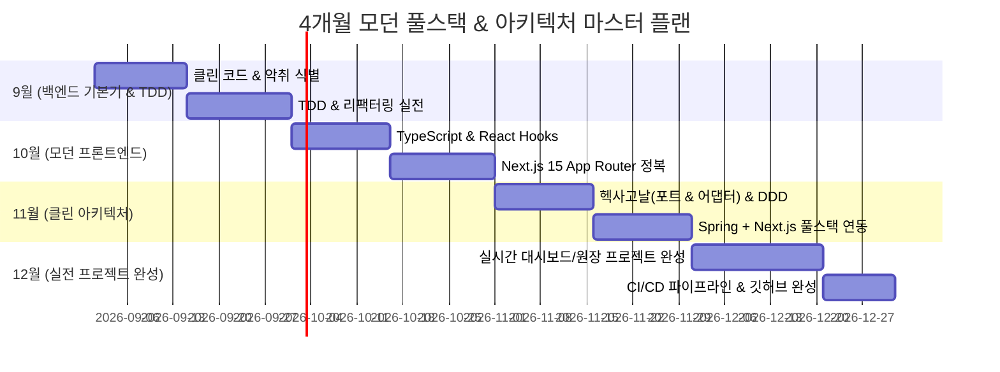

# 🚀 Software Craftsmanship & Modern Architecture Study

> **6년 차 금융/엔터프라이즈 백엔드 엔지니어의 모던 소프트웨어 장인정신(Clean Code, TDD, Hexagonal Architecture, Next.js) 마스터 로드맵**

본 저장소는 레거시 환경을 넘어 **클린 코드, 리팩터링, 테스트 주도 개발(TDD), 헥사고날/클린 아키텍처, 모던 프론트엔드(Next.js + React)**를 이론(책)과 실무 코드(`account` 프로젝트)로 연결하여 체화하는 스터디 아카이브입니다.

---

## 🗺️ 4개월 마스터 로드맵 (2026 하반기)



---

## 📂 챕터별 스터디 디렉토리

| 챕터 | 주제 | 주요 내용 | 링크 |
| :--- | :--- | :--- | :--- |
| **01** | **클린 코드 & 기본기** | 의미 있는 이름, 함수 분리, Null 방어, `Optional<T>` | [01-clean-code](./01-clean-code/README.md) |
| **02** | **코드 악취 & 리팩터링 2판** | 24가지 코드 스멜, 조건문 분해, 메서드 추출, 전략 패턴 | *(예정)* |
| **03** | **TDD & 단위 테스트의 정석** | Red-Green-Refactor, 화폐 예제, 순수 도메인 테스트 | *(예정)* |
| **04** | **진짜 객체지향 (오브젝트)** | 역할/책임/협력, 자율적인 객체, 불변식(Invariant) | *(예정)* |
| **05** | **헥사고날 & 클린 아키텍처** | Inbound/Outbound Port, Adapter, DDD Aggregate Root | *(예정)* |
| **06** | **모던 프론트엔드 (Next.js 15)** | TypeScript, React 19, RSC, TanStack Query 대시보드 | *(예정)* |

---

## 💻 실행 및 하네스(Harness) 가이드

어떤 컴퓨터에서든 Java 17 이상만 설치되어 있으면 다른 도구 없이 즉시 컴파일 및 실행할 수 있습니다.

### Windows
```powershell
# 01-clean-code 실행
./run.bat
```

### Linux / Mac
```bash
./run.sh
```
